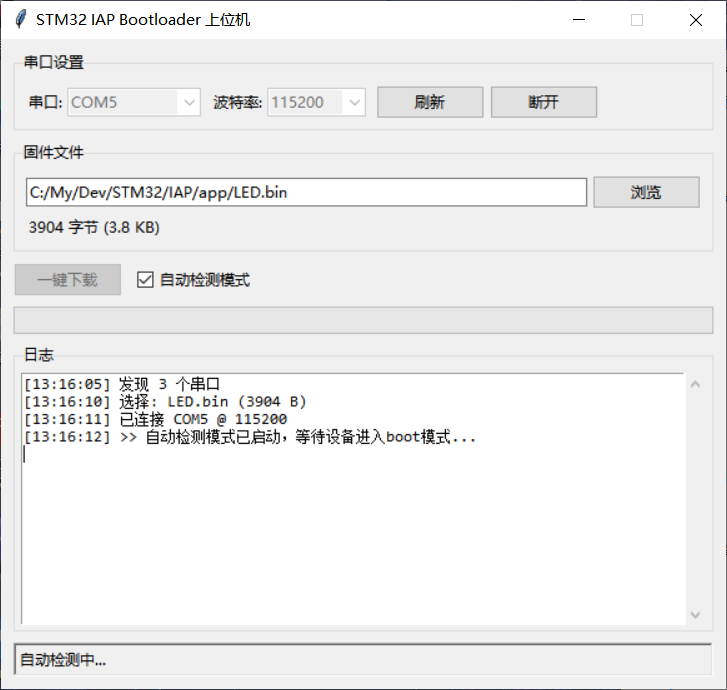
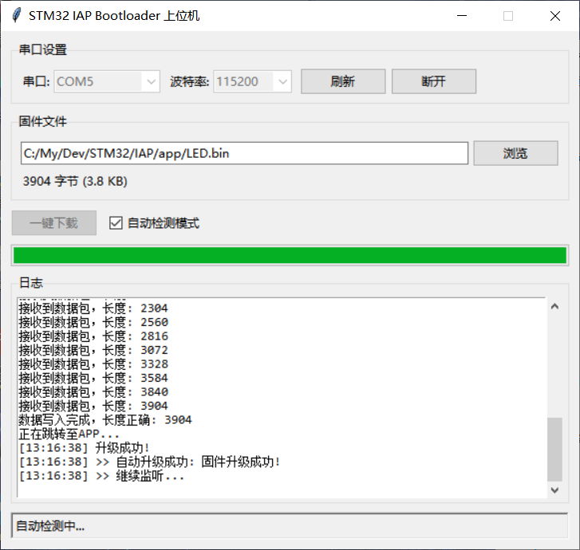

# STM32 IAP Bootloader

基于 STM32F103C8T6 的 IAP（In-Application Programming）Bootloader，支持串口固件升级。

## 功能特点

- **串口升级**：通过 UART 接收固件并写入 Flash
- **APP 跳转**：启动时自动检测并跳转到应用程序
- **Flash 擦写**：支持按页擦除和写入
- **配套上位机**：提供 Python GUI 工具进行固件下载

## 硬件要求

- STM32F103C8T6 最小系统板
- 串口连接（UART1）

## 内存布局

| 区域 | 起始地址 | 大小 | 说明 |
|------|---------|------|------|
| Bootloader | 0x08000000 | 10KB | 引导程序 |
| APP | 0x08002800 | 54KB | 应用程序 |

## 通信协议

| 步骤 | 上位机发送 | 设备响应 |
|------|-----------|---------|
| 握手 | `upgrade:"<文件大小>"` | 确认数据包长度 |
| 擦除 | 等待 | 擦除 Flash 页 |
| 传输 | 256 字节/包，间隔 100ms | 接收数据包 |
| 完成 | 等待 | "数据写入完成，长度正确" |

## 项目结构

```
STM32/IAP/
├── bootloader/               # Bootloader 源码（STM32 工程）
│   ├── Core/                 # HAL 库和用户代码
│   ├── Drivers/              # STM32 HAL 驱动
│   ├── interface/            # Bootloader 接口层
│   └── MDK-ARM/              # Keil 工程文件
├── app/                      # 示例应用程序（LED.bin）
├── bootloader_uploader.py    # 配套上位机工具
└── README.md
```

## 配套上位机

提供 Python GUI 工具用于固件升级，支持：
- 手动模式：选择 .bin 文件，一键下载
- 自动模式：监听串口，检测设备进入 boot 模式后自动升级

运行方式：

```bash
pip install pyserial
python bootloader_uploader.py
```




## 技术参数

- Bootloader 大小：10KB
- 最大固件大小：54KB
- 分包大小：256 字节
- 分包间隔：100ms
- 默认波特率：115200

## 踩坑记录：`__set_MSP()` 后的编译器栈操作

使用 `__set_MSP(app_stack_prt)` 设置 App 的栈顶后，函数收尾时编译器会插入 `ldmia sp!, {r4,r5,r6,lr}`，这条指令从**新 SP**（App 的栈顶）读取 16 字节并 SP += 16。若 App 的 `_estack` 在 RAM 末尾（如 STM32F103C8T6 的 `0x20005000`），则越界读触发 BusFault。

**修复**：用纯汇编函数实现跳转，`MSR msp, r0` 后直接 `BX r1`，中间没有任何栈操作：

```c
__asm void boot_jump(uint32_t sp, uint32_t pc) {
    MSR msp, r0
    BX r1
}
```

**原因**：`__set_MSP()` 展开为 `msr MSP, rn`，但编译器不知道这条指令改变了栈指针，仍为外层函数生成标准的 `push`/`ldmia sp!` 收尾代码。修改 MSP 后，`sp!` 操作的是新栈而非旧栈。

## 许可证

Apache License 2.0
